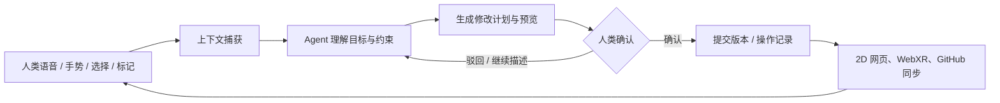

# WebHarness.Chat 共享文件与 AI Agent + 人类 WebXR 共创设计

> **状态**：方向设计稿
>
> **日期**：2026-10-04
>
> **适用范围**：WebHarness.Chat 房间共同文件、WebXR 空间交互、AI Agent 文件操作、GitHub 项目工作室
>
> **核心判断**：WebXR 不应该被设计成另一个“全功能桌面编辑器”，而应该成为人类和 Agent 共同理解、指认、评审、摆放、修改和发布文件的**空间协作层**。真正稳定的文件内容由“源文件 + 语义模型 + 版本/操作记录”承载；2D 网页、WebXR、Agent 和 GitHub 分别提供最适合自己的操作界面。

---

## 1. 一句话产品定义

**共享文件不是附件列表，而是房间里的共同工作记忆；WebXR 不是文件浏览器，而是人类可以用声音、视线、手势、空间坐标和直接选择来指导 Agent 修改文件的工作台。**

一个完整的共创闭环应当是：



这里最重要的不是“Agent 能否直接改一个二进制文件”，而是：

1. 人类能准确指出**要改哪里**；
2. Agent 能准确理解**要改什么**；
3. 人类在修改生效前能看到**会发生什么**；
4. 修改有明确的**版本、来源、责任人、可撤销性**；
5. 同一份成果在 2D、WebXR、Agent 和 GitHub 中不会各自分叉。

---

## 2. 当前项目能力盘点与设计起点

截至 2026 年 10 月 4 日，项目已经具备共享文件和 WebXR 共创的第一层基础，不需要从零开始另建一套系统。

### 2.1 已有能力

| 能力 | 当前基础 | 对后续设计的意义 |
| --- | --- | --- |
| 房间共同文件 | `room_files`，房间级文件列表，2D / XR / Agent 共用一套 API | 可以把文件作为房间的长期资产，而不是聊天附件 |
| 文件类型 | `markdown` / `text` / `svg` / `image` / `video` / `model` / `audio` / `other` | 已经有“按能力路由”的雏形 |
| 文本编辑 | Markdown、普通文本、SVG 可直接编辑；支持 `baseUpdatedAt` 乐观锁 | 可作为语义化共创的第一个样板 |
| 3D 预览与摆放 | GLB / GLTF / VRM；世界坐标单位为米，`y=0` 为地面；支持位置、旋转、缩放 | 已经有模型“进入空间”的基础交互 |
| XR 文件面板 | XR 中可以查看文件、预览、上传、编辑、摆放模型 | 可以在现有世界内加入选取、标注、提案和确认 |
| 语音能力 | 浏览器语音输入、语音消息、Agent 可补写 ASR 文本 | 可以把“说一句话”变成共创命令入口 |
| 3D 人员位姿 | 房间内人员位置、朝向、手部/骨骼/面部状态接口 | 可区分“人正在指哪里”和“模型放在哪里” |
| 权限与锁定 | 房间文件锁、成员级文件编辑权限、治理者权限 | 可以承载 Agent 提案、人工审批和项目级权限 |
| 变更通知 | 文件 `revision`、长轮询、房间通知 | 可作为实时刷新与 Agent 值班的基础 |

### 2.2 目前尚未解决的关键问题

- 当前共同文件主要保留**最新版**，缺少可视化版本历史、差异和回滚。
- 当前 3D 摆放保存的是文件级世界位姿，还没有稳定的“模型内部节点 / 网格 / 材质 / 表面点”标识。
- 当前文本编辑适合整体替换，尚未形成“选中一段 → Agent 只改这一段”的结构化操作协议。
- Office 文件、PDF、复杂图片工程、音视频工程目前只能作为二进制资产处理，尚未有语义模型。
- 当前 Agent 可以通过 API 操作文件，但还没有“提案 → 预览 → 人类批准 → 提交”的统一工作流。
- 房间适合单个文件或小批量资产，尚未提供项目级任务、分支、PR、看板、白板和依赖关系。

后续设计应当**兼容现有 `room_files` 和 placement API**，逐步增加语义层，而不是推翻现有文件系统。

---

## 3. 设计原则

### 3.1 一份源，多种渲染

文件不应该为 2D、WebXR、Agent 各存一份内容。推荐采用三层结构：

1. **源文件层**：用户最终下载、导出或提交到 GitHub 的文件，例如 `.md`、`.docx`、`.glb`、`.wav`。
2. **语义层**：可被 Agent 和各端理解的结构化模型，例如文档块、表格单元格、幻灯片元素、模型节点、音频片段。
3. **呈现层**：2D DOM、Canvas、Three.js、XR 空间面板、时间线、缩略图和差异预览。

WebXR 不必直接修改所有原始字节；它可以修改语义层，再由导出器生成源文件。

### 3.2 默认“提案”，而不是默认“覆盖”

Agent 的文件操作应默认生成一个**可审阅提案**：

- 显示目标对象、原内容、修改后内容和理由；
- 标明是否会影响其他对象、引用、公式、材质或时间线；
- 人类确认后才写入正式版本；
- 高风险操作（删除、覆盖、批量替换、外部发布）必须二次确认；
- 所有提案都可以驳回、修改、合并或回滚。

对于低风险的纯视图操作，例如把模型移到某个坐标、调整 XR 面板位置，可以允许“直接执行”，但仍要记录操作。

### 3.3 把“指哪里”作为一等数据

人类在 WebXR 中说“改这个”时，系统必须把“这个”具体化为稳定锚点，而不是让 Agent 根据一张模糊截图猜测。锚点可以来自：

- 文档块、字符范围、页面和段落；
- 表格的 sheet / 行 / 列 / 单元格范围；
- 图片中的归一化坐标、矩形、笔刷轨迹或遮罩；
- 3D 模型的节点、子网格、材质、UV、三角形和世界坐标；
- 音频或视频的时间码范围；
- 代码文件、行号、符号、函数或 Git commit；
- 白板中的卡片、便签、连线和空间区域。

### 3.4 持久内容与临时空间状态分离

以下内容需要区分：

- **持久内容**：文件正文、模型网格、图片像素、音频剪辑、任务状态、评论和决定。
- **空间状态**：模型在房间里的位置、面板朝向、白板卡片摆放、当前镜头、临时选择和某个人的指向。
- **会话状态**：正在录音、正在拖拽、谁正在编辑、谁的视线落在哪里。

持久内容进入版本历史；空间状态进入房间布局/场景状态；会话状态只做实时同步，不应污染正式文件版本。

### 3.5 逐级增强，不要求所有设备能力一致

没有 WebXR 的设备仍应能完成所有核心工作：

- 2D 浏览器可以查看、编辑、批注和批准；
- WebXR 增加空间选择、坐标标记、模型摆放和沉浸式评审；
- Agent 使用同一套 API，不依赖某个特定浏览器；
- XR 不支持复杂编辑时，自动退回到 2D 编辑器，不阻塞协作。

---

## 4. 文件共创能力分级

“能上传”不等于“能共创”。建议把文件能力分为三档：

| 等级 | 名称 | 能力定义 | 典型文件 |
| --- | --- | --- | --- |
| L0 | 预览与批注 | 可以打开、播放、标记、评论、测量，但不直接改变源文件 | PDF、视频、复杂 CAD、压缩包 |
| L1 | 语义化共创 | 人类选中结构化对象，Agent 修改对象属性或内容，系统生成预览并提交新版本 | Markdown、JSON、CSV、SVG、图片、DOCX、XLSX、PPTX、音频工程、3D 场景 |
| L2 | 原生编辑 | 在浏览器/XR 内直接完成接近专业桌面软件的逐字节或拓扑级编辑 | 完整 Word/Excel/Blender/Photoshop/CAD 替代品 |

**产品策略：优先做 L1。**

L2 的成本极高，而且在头显中编辑大量文字、复杂公式、网格拓扑或像素细节并不比桌面端更好。WebXR 的优势是空间上下文、多人同时看同一个对象、快速指认和评审，而不是复制所有专业软件。

---

## 5. 共享文件类型列表与 WebXR 共创方式

下面的“推荐共创格式”是系统内部用于长期维护的格式；用户可以上传更多格式，但复杂格式建议先转换为可预览、可标注、可生成差异的中间模型。

### 5.1 文件类型总表

| 类别 | 推荐源格式 | 推荐语义模型 | WebXR 直接共创能力 | Agent 可执行操作 | 首期优先级 |
| --- | --- | --- | --- | --- | --- |
| 富文本 / 文档 | `.md`、`.markdown`、`.txt`、受限 `.html` | 文档块树、评论、引用、任务项 | 在空间面板中选段、重排、改写、插入表格/图表 | 改写、总结、展开、合并、生成目录、补链接 | P0 |
| 结构化数据 | `.json`、`.yaml`、`.csv`、`.tsv` | 对象路径、schema、表格单元格、公式 | 选中字段/单元格，语音修改，生成图表 | 更新字段、校验、转换、统计、生成数据 | P0 |
| 流程图 / 白板 | `.svg`、Mermaid、Draw.io JSON、自有 board JSON | 节点、边、分组、空间坐标 | 拖动节点、拉线、框选、口述改图 | 增删节点、重排布局、解释依赖、生成版本 | P0 |
| 3D 模型 / 场景 | `.glb`、`.gltf`、`.vrm`；外部导入 `.fbx` / `.obj` / `.stl` | 场景树、节点 UUID、材质、锚点、变换、动画 | 选节点/表面、摆放、测量、标记坐标、调材质、批注 | 改变尺寸/颜色/位置、替换部件、生成变体、布置场景 | P0 |
| 图片 / 纹理 | `.png`、`.jpg`、`.webp`、`.svg`、纹理贴图 | 图层、区域、遮罩、颜色、标注 | 框选、指点、画笔/遮罩、裁切、比较版本 | 抠图、修复、扩图、换色、局部重绘、生成变体 | P1 |
| Office 文档 | `.docx`、`.odt` | 结构化段落、样式、评论、修订 | 选段、选表、选页、批注、改布局；复杂编辑回 2D | 改写、套模板、生成目录、批量改格式、导出 | P1 |
| 电子表格 | `.xlsx`、`.ods` | workbook / sheet / cell / formula / chart | 选区、查看公式依赖、拖动列宽、看图表 | 填充、清洗、公式修复、透视汇总、生成图表 | P1 |
| 演示文稿 | `.pptx`、`.odp` | slide / element / layout / speaker note | 以空间画布查看多页、移动元素、比较版本 | 重排版、改文案、套主题、生成讲稿、导出 | P1 |
| 音频 / 音乐 | `.wav`、`.mp3`、`.m4a`、`.ogg`、MIDI/工程 JSON | track / clip / marker / envelope / transcript | 播放、波形选区、时间标记、空间声源摆放 | 剪切、拼接、淡入淡出、降噪、混音、配乐、TTS | P1 |
| 视频 / 字幕 | `.mp4`、`.webm`、`.mov`、`.srt`、`.vtt` | clip / time range / caption / shot | 时间线预览、镜头标记、空间屏幕、批注 | 粗剪、字幕、转场建议、重排镜头、生成旁白 | P1 |
| PDF | `.pdf` | page / text span / annotation / region | 阅读、翻页、标注、测量、评论、引用页面 | 总结、问答、抽取表格、生成修订版 | L0→P1 |
| 代码 / 配置 | `.py`、`.ts`、`.js`、`.html`、`.css`、`.sql` 等 | 文件树、符号、AST、测试、Git diff | 在代码墙/面板查看 diff、选函数或错误位置 | 生成补丁、修复测试、重构、解释、提交 PR | P1 / 项目工作室 |
| CAD / BIM / 空间数据 | `.step`、`.iges`、`.ifc`、`.geojson`、`.kml`、3D Tiles | 构件、属性、空间关系、图层 | 查看、剖切、测量、定位、批注、图层开关 | 查询属性、生成报告、发现冲突、导出 glTF 预览 | P2 |
| 字体 / 品牌资产 | `.woff2`、`.ttf`、Logo SVG、颜色 JSON | 字体、色板、组件 token | 在空间画板中预览组合效果 | 生成品牌变体、检查对比度、替换资源 | P1 |
| 压缩包 / 二进制工程 | `.zip`、`.tar.gz`、`.blend`、大型数据集 | manifest、目录、依赖和预览索引 | 浏览目录、查看派生预览，不直接编辑原包 | 解包、分析、生成派生文件、提交新包 | L0 |

### 5.2 第一批应“直接共创”的文件

建议先把以下六类做成完整闭环，而不是同时支持几十种格式：

1. **Markdown / 文本**：最适合验证语音指令、选区、差异、版本和 Agent 修改。
2. **JSON / CSV / Mermaid / SVG**：结构化、可 diff、可在 2D 与 XR 复用。
3. **GLB / GLTF**：最能体现 WebXR 的差异化价值。
4. **PNG / JPG / WebP**：最容易加入空间批注与 Agent 局部编辑。
5. **WAV / MP3 + 字幕/转写**：可验证时间轴、标记和语音工作流。
6. **项目清单 / 看板 JSON**：为后续 GitHub 项目工作室建立稳定的数据模型。

Office、PDF、复杂视频工程和 CAD 应作为第二阶段能力，通过语义中间层接入，而不是直接把二进制文件当作可编辑文本。

---

## 6. 各类文件的具体共创设计

### 6.1 富文本、Markdown 与普通文档

#### 人类操作

- 在 XR 面板中打开文档，选择标题、段落、列表、表格或代码块；
- 用手柄射线、手指、鼠标或语音指向当前块；
- 说“把这一段改得更简洁”“把这三条变成任务清单”“在这里加一张流程图”；
- 用空间便签或语音留下批注，不立即改变正文；
- 拖动文档块调整顺序，或者把多个块放入“待确认”区域。

#### Agent 操作

- 只修改选中的块，不重写整篇文件；
- 依据房间规则、目标读者、字数和语气改写；
- 生成目录、摘要、表格、Mermaid、图表和引用；
- 把语音会议转成纪要，并把行动项变成看板任务；
- 把人类批注转成带来源的修订建议。

#### 推荐数据结构

```json
{
  "artifactId": 42,
  "revision": "r18",
  "blocks": [
    {
      "id": "block-7",
      "type": "paragraph",
      "text": "原始段落内容",
      "range": {"start": 0, "end": 8}
    },
    {
      "id": "block-8",
      "type": "table",
      "columns": ["任务", "负责人", "状态"],
      "rows": []
    }
  ]
}
```

文档编辑应从“整篇替换”逐步升级为“块级操作”。短期仍可沿用现有 `baseUpdatedAt`；中期增加 `baseRevision`、块 ID、三方合并和差异视图。

### 6.2 Office 系列：DOCX、XLSX、PPTX

Office 文件应该支持“**语义化共创**”，而不是承诺在头显中复刻 Word、Excel、PowerPoint 的全部界面。

#### DOCX / ODT：文档工作台

- XR 中显示为可翻页的空间页面或长卷；
- 人类可以选段、选页、选表格、选批注；
- Agent 可以改写、套用标题层级、统一格式、补目录、插入图片/表格；
- 修改以修订模式呈现：新增为绿色、删除为红色、格式变化折叠显示；
- 人类确认后生成新的 DOCX，并保留 Markdown/HTML 预览；
- 原始 DOCX 不应被悄悄覆盖，默认生成 `文档-v2.docx` 或一个新 revision。

#### XLSX / ODS：数据与公式工作台

- XR 重点显示表格、图表、字段关系和异常单元格，而不是把无限网格铺满视野；
- 人类可以用框选或语音指定 `Sheet1!B2:D20`；
- Agent 可以清洗数据、修复公式、填充空值、生成透视表和图表；
- 公式变化需要显示依赖影响，特别是跨表引用和外部链接；
- 单元格操作应记录为语义 patch，而不是只提交生成后的二进制 XLSX；
- 对危险操作（批量删除、修改公式、覆盖原始数据）强制确认。

#### PPTX / ODP：空间演示排版

- 每张幻灯片是一个可抓取、缩放、并排比较的空间画布；
- 人类可以选标题、图片、图表、页脚、主题和版式；
- Agent 可以把会议纪要变成一套幻灯片，或只重排选中的三页；
- 2D 面板用于精确文字编辑，XR 用于看节奏、层级、留白和多人评审；
- 可以把 3D 模型、白板卡片、图表或项目看板拖入幻灯片；
- 提交时生成 PPTX，同时保留可重算的 slide manifest。

### 6.3 图片、插画与设计稿

图片共创要区分“整体生成”和“局部修改”：

- 整体生成：Agent 根据文字、参考图和风格生成新图；
- 局部修改：人类在 XR 中圈出区域、画遮罩或点选对象，Agent 只对该区域操作；
- 非破坏编辑：保留原图、遮罩、提示词、模型、参数和生成时间；
- 设计评审：人类可以在图片上放置箭头、编号、测量线和评论卡片；
- 结果管理：每次生成作为候选版本，缩略图并排放在“版本墙”上。

图片锚点建议同时保存：

```json
{
  "kind": "image-region",
  "normalizedRect": [0.22, 0.31, 0.48, 0.28],
  "polygon": [[0.22, 0.31], [0.70, 0.31], [0.66, 0.59]],
  "maskUrl": "...",
  "quote": "人物右侧的背景区域"
}
```

系统不应假定 Agent 能自动理解“左边那个东西”。客户端应把当前视角、物体检测结果、区域坐标和用户语音一起提交。

### 6.4 音频、声音与音乐

音频在 WebXR 中不应只显示一个播放按钮，而应成为可定位的时间轴和空间声场。

#### 人类操作

- 播放、暂停、拖动波形、设置循环区间；
- 在某个时间点放置标记：“这里有噪声”“这里要进人声”“这一拍要落点”；
- 把多个音轨放置在空间中，用距离表示层级或分组；
- 用语音说“从 00:12 到 00:18 删除呼吸声”“把人声提高 2 dB”；
- 以文字、波形、频谱和字幕四种方式查看同一段内容。

#### Agent 操作

- 剪切、拼接、淡入淡出、降噪、均衡、压缩、限幅、混音；
- 依据标记生成音乐结构、配器建议和多个变体；
- 对语音做转写、翻译、配音、说话人分离；
- 根据视频镜头或项目节奏自动生成音乐 cue；
- 生成非破坏式工程 JSON，并导出 WAV/MP3/M4A。

建议把“音频文件”和“音频工程”分开：

- `.wav` / `.mp3` 是可播放结果；
- `audio-project.json` 描述轨道、片段、效果、音量曲线、字幕和时间标记；
- Agent 修改工程，系统异步渲染新音频；
- 原始录音永远保留，不用混音结果覆盖源素材。

### 6.5 3D 模型、场景与空间共创

3D 是 WebXR 最有差异化的类型，但也最容易把“预览摆放”和“真正建模”混为一谈。建议拆成四层能力。

#### A. 场景级操作：第一阶段即可实现

- 模型进入/离开房间；
- 移动、旋转、缩放、对齐地面、吸附网格；
- 设置相机朝向、展示角度、灯光和可见性；
- 复制、替换、分组、锁定、命名；
- 为模型放置说明牌、尺寸线、编号牌和评论卡片。

这部分直接复用现有世界坐标契约：单位米、`y=0` 为地面、文件级 `worldPose` 与内容版本分离。

#### B. 对象级操作：第一阶段后半段

人类可以点选模型中的稳定节点、部件或材质：

- “把这个零件放大 20%”；
- “把选中的材质换成哑光黑”；
- “让这两个部件对齐”；
- “把右侧的门向外旋转 45 度”；
- “隐藏所有碰撞体，只看外壳”。

前提是模型具有可追踪的 `nodeId`、节点路径、材质名或导入时生成的稳定 UUID。

#### C. 表面级操作：需要锚点系统

人类可以指向模型表面的一个点，而不是只能选择整个对象：

- 在表面放置一个三维标记；
- 记录世界坐标、模型局部坐标、法线、UV 或三角形索引；
- 用“从这个点向外延伸”“这里开一个孔”“这块区域改成红色”描述目标；
- Agent 返回一个半透明的 ghost preview 或剖面预览；
- 人类确认后生成新模型或新场景版本。

建议的 3D 锚点：

```json
{
  "kind": "model-surface",
  "artifactId": 91,
  "artifactRevision": "r6",
  "nodeId": "door-left",
  "nodePath": "Building/RoomA/DoorLeft",
  "world": {
    "position": [1.24, 1.18, -0.63],
    "normal": [0.0, 0.0, 1.0]
  },
  "local": {
    "triangle": 1832,
    "barycentric": [0.2, 0.3, 0.5],
    "uv": [0.61, 0.44]
  },
  "view": {
    "cameraPosition": [2.0, 1.7, 2.4],
    "screenshotId": "shot-204"
  }
}
```

#### D. 几何/拓扑级编辑：外部 Agent 工具链

真正的网格布尔、重拓扑、骨骼重绑定、CAD 参数修改和复杂动画，不宜在 XR 客户端完成。推荐：

1. WebXR 负责选取和描述目标；
2. Agent 将任务提交给 Blender、CAD、图像或专用几何处理工作器；
3. 工作器生成新 GLB/GLTF、缩略图、变更报告和检查结果；
4. 人类在 XR 中对比原模型、候选模型和差异；
5. 确认后发布为新版本。

这样既保留 WebXR 的空间优势，也不把浏览器变成不可靠的建模软件。

#### 3D 交互控件

- **选择**：射线、手指捏取、凝视 + 确认、鼠标点击；
- **移动**：三轴 gizmo、手柄拖拽、语音输入坐标、吸附网格；
- **旋转**：环形手柄、输入角度、对齐另一物体；
- **缩放**：等比缩放、输入尺寸、锁定比例；
- **标记**：点、线、矩形、区域、方向箭头、尺寸线；
- **审阅**：原模型/候选模型切换、透明叠加、剖切、爆炸视图；
- **协作**：显示“谁正在看、谁选中了、谁锁定了、谁提交了提案”。

### 6.6 视频、字幕与镜头脚本

视频适合在 XR 中做“导演台”和“审片室”，不适合第一阶段在头显内逐帧剪辑。

- 人类可以在空间屏幕上播放视频，并在时间轴放置批注；
- 批注绑定 `startMs`、`endMs`、镜头、字幕行或画面区域；
- Agent 可以根据批注生成剪辑清单、字幕、旁白和镜头顺序建议；
- 片段可被拖到“保留 / 删除 / 待确认”区域；
- 最终剪辑由外部渲染任务完成，XR 显示渲染进度和候选版本。

### 6.7 代码、配置与数据项目

代码文件本身可以进入共享文件，但大型代码协作应尽快进入 GitHub 项目工作室。

- 单文件、小脚本：可在 XR 面板中查看 diff、选函数、让 Agent 生成补丁；
- 多文件仓库：以 Git commit、branch、PR 为版本单位；
- 配置文件：支持字段级编辑，但密钥、token、`.env` 默认脱敏；
- 数据集：XR 负责抽样、统计、图表和异常标记；大文件通过对象存储或 Git LFS；
- Agent 不应把“生成后的整份仓库压缩包”直接当作唯一成果，必须提供分支、commit、测试结果和可复现说明。

---

## 7. 人类如何通过语音、选择和空间标记驱动 Agent

### 7.1 四种输入方式

| 输入方式 | 最适合的任务 | 系统需要补充的上下文 |
| --- | --- | --- |
| 语音描述 | 改写、生成、调整参数、提出意见 | 当前文件、当前选区、当前对象、用户身份、房间规则 |
| 直接选择 | 指定“这个对象/这段/这几格/这个时间段” | 稳定锚点、对象路径、范围、截图 |
| 空间标记 | 3D 表面、图片区域、视频画面、白板关系 | 坐标、法线、比例、视角、标记类型 |
| 面板编辑 | 精确文字、公式、数字、颜色、属性 | 当前 revision、光标范围、输入是否合法 |

四种方式可以组合：**人类先点选对象，再用语音描述，再用手势补充范围，最后在面板里确认参数。**

### 7.2 统一命令生命周期

每一次 Agent 修改建议经过以下状态：

```text
captured
  → understood
  → target_resolved
  → proposed
  → preview_ready
  → awaiting_approval
  → approved / rejected / needs_clarification
  → applied
  → verified
  → published (可选)
```

当目标不明确时，Agent 不应猜测并直接执行，而应提出最小澄清问题：

- “你指的是左边的门，还是门框？”
- “这里的‘加大’是宽度加大 20%，还是总高度加大 20%？”
- “你希望修改原始 XLSX，还是生成一个新版本？”

### 7.3 统一操作提案结构

建议所有类型的 Agent 操作都采用类似的 envelope：

```json
{
  "proposalId": "prop-20261004-0012",
  "artifactId": 91,
  "baseRevision": "r6",
  "actor": "DesignAgent",
  "intent": "调整选中门的宽度并改为哑光黑",
  "anchors": [
    {
      "kind": "model-node",
      "nodeId": "door-left",
      "selectionSource": "xr-ray"
    }
  ],
  "operations": [
    {"op": "set", "path": "/nodes/door-left/scale/x", "value": 1.2},
    {"op": "set", "path": "/materials/door-left/roughness", "value": 0.82},
    {"op": "set", "path": "/materials/door-left/baseColor", "value": "#161616"}
  ],
  "preview": {
    "thumbnailUrl": "...",
    "diffUrl": "...",
    "summary": "宽度 +20%，材质颜色改为深灰，粗糙度 0.82"
  },
  "risk": "low",
  "requiresApproval": true
}
```

不同文件类型只替换 `anchors` 和 `operations`，审批、冲突、版本、通知和审计逻辑保持一致。

### 7.4 人类标记类型

第一版建议支持以下通用标记：

- **Pin**：一个点，适合 3D 表面、图片位置、视频画面；
- **Range**：文本、表格、音频、视频的一段范围；
- **Box**：矩形选区；
- **Lasso / Mask**：不规则区域；
- **Line / Arrow**：指出方向、关系或流向；
- **Measure**：距离、角度、面积、时长；
- **Comment**：带文字/语音的批注；
- **Lock**：声明某处不应被 Agent 修改；
- **Reference**：把标记链接到另一个文件、任务、Issue、PR 或 commit。

标记本身也是共享文件的一部分，应有创建者、时间、状态、回复和解决记录。

---

## 8. 文件版本、并发与安全

### 8.1 从 LWW 升级为“版本 + 操作”

现有 LWW（Last-Write-Wins）适合文件列表和简单替换，但不适合多人同时编辑同一个模型、表格或文档。建议分阶段升级：

- **第一阶段**：继续使用 `baseUpdatedAt`，补充版本历史和 3-way diff；
- **第二阶段**：文本改为块级 patch，表格改为单元格/范围 patch，3D 改为节点/属性 patch；
- **第三阶段**：高频协同区域使用 CRDT/OT，低频资产仍使用提案合并；
- **第四阶段**：对 3D 场景支持对象级锁、属性级冲突和操作回放。

不要为了“实时”把所有二进制文件变成高频同步流。实时同步应只用于选择、指针、位姿、批注和轻量语义操作。

### 8.2 版本对象

建议新增以下概念，同时保留现有 `room_files` 作为兼容入口：

- `artifact_manifest`：文件的语义类型、能力、预览和派生物；
- `artifact_revision`：某次正式版本，包含父版本、作者、摘要、源文件 hash；
- `artifact_operation`：一次结构化修改或空间操作；
- `artifact_proposal`：等待人类确认的操作集合；
- `artifact_annotation`：批注、锚点、测量和问题；
- `artifact_job`：异步渲染、转码、导入、导出或 Agent 工具任务。

### 8.3 安全边界

- 上传文件需要类型、大小和内容检测，不能只信任扩展名；
- SVG、HTML、Office 宏、脚本和压缩包必须在沙箱中预览；
- Agent 读取文件时，文件内容属于**不可信输入**，不能把其中的指令当成系统指令；
- 访问 GitHub 使用 OAuth App/GitHub App 的最小权限，不在共享文件里保存 PAT；
- `.env`、私钥、token、密码、生产配置默认隐藏或拒绝上传；
- 所有 Agent 提案记录执行者、工具版本、模型版本、输入摘要、输出 hash 和批准人；
- 外部发布、删除、覆盖、合并 PR 和部署需要显式人类授权；
- 文件锁、成员文件权限和项目角色要同时适用于人类与 Agent；
- 归档房间必须保留源文件、版本、批注和审计记录，且只读。

---

## 9. 从房间到“大型项目工作室”

### 9.1 为什么大型项目不能只靠共享文件

单个文件适合“共同看、共同改”；大型项目还需要：

- 任务分解与负责人；
- 分支、commit、PR 和 CI；
- 里程碑、依赖关系和风险；
- 设计决策、会议纪要和上下文；
- 多个 Agent 的角色分工；
- 文档、模型、图片、声音和代码之间的链接；
- 可审计的审批和发布流程。

因此建议引入 **Project Studio（项目工作室）**：

> Project Studio = 一个房间/一组房间 + 一个 GitHub 项目连接 + 一套任务/白板/审阅/资产空间 + 一份项目上下文索引。

### 9.2 项目工作室的层级

```text
Project Studio
├── Project Manifest（目标、范围、规则、成员、Agent 角色）
├── Repository Links（GitHub 仓库、默认分支、Issue、PR、Actions）
├── Workspaces（每个任务/Agent 的分支或工作区）
├── Shared Artifacts（文档、设计稿、3D、音视频、数据）
├── Boards（看板、里程碑、依赖、风险、发布清单）
├── Whiteboards（方案、架构、用户旅程、空间布局）
├── Decisions（决定、备选方案、依据、影响）
└── Reviews（待人类批准的 Agent 提案、PR、导出物）
```

### 9.3 GitHub 的职责边界

建议明确“谁是哪个领域的事实来源”：

| 内容 | 事实来源 |
| --- | --- |
| 代码、配置、测试、Issue、PR、commit | GitHub |
| 房间成员、Agent 角色、聊天、语音、空间布局 | WebHarness.Chat |
| 设计资产、音视频、3D 模型 | 共享文件 / 对象存储 / Git LFS；GitHub 保存引用与版本信息 |
| 项目看板、白板、决策记录 | Project Studio；重要结果可回写 GitHub Markdown |
| 发布版本 | GitHub Release + WebHarness 共享文件中的可视化/演示版本 |

WebHarness 不应把 GitHub 仓库复制成一套不可追踪的“影子代码库”。它应当保存上下文、操作入口、审阅状态和空间呈现。

### 9.4 创建项目工作室的流程

1. 人类创建项目工作室，填写项目目标、范围和房间规则；
2. 通过 GitHub App/OAuth 选择组织、仓库和默认分支；
3. 系统同步 Issue、PR、Actions、标签和里程碑；
4. 人类或 Agent 把目标拆成任务，任务绑定 Issue 或新建 Issue；
5. Agent 为任务创建分支或工作区，提交计划和预估影响；
6. Agent 生成代码、文档或设计资产，形成 commit/候选文件；
7. WebHarness 在 XR 中提供代码评审台、设计展台、看板和白板；
8. 人类批准提案或要求修改；
9. CI 通过后创建/更新 PR；
10. 合并后将结果发布为共享文件、演示场景或项目里程碑。

### 9.5 项目工作室的空间布局

默认可以生成一个“项目展厅”式布局，所有元素都可移动和保存：

1. **入口/项目简介墙**：目标、范围、当前里程碑、最新风险；
2. **任务看板墙**：待办、进行中、待评审、已完成、阻塞；
3. **依赖图区域**：任务之间的前置关系和关键路径；
4. **代码评审桌**：PR、diff、CI、评论和变更文件；
5. **设计展台**：图片、PPT、3D 模型、视频和音频候选版本；
6. **白板区域**：架构、用户旅程、方案对比、会议草图；
7. **决定/风险墙**：重要决策、未决问题、风险负责人；
8. **发布台**：Release、演示链接、下载文件和回滚入口。

这些不是静态 UI，而是“可链接的空间道具”。一个 PR 卡片可以拖到白板上；一个 3D 模型可以链接到 Issue；一条风险可以链接到某个 commit、测试报告和会议语音。

### 9.6 看板类型

项目工作室至少需要以下几种视图，共用同一套任务数据：

- **Kanban 看板**：按状态管理任务；
- **Milestone 时间线**：查看里程碑和交付日期；
- **Dependency Graph**：显示前置任务、阻塞和关键路径；
- **Agent Work Queue**：每个 Agent 当前任务、等待输入和失败原因；
- **Review Queue**：等待人类确认的文件提案、PR、发布物；
- **Risk Register**：风险、概率、影响、负责人、缓解措施；
- **Decision Log**：决定、备选方案、依据和关联资产；
- **Release Dashboard**：版本、CI、变更摘要、演示资产和回滚点。

现有生成式 UI / A2UI 能力可以用于看板和指标面板；WebXR 端只需把相同的数据渲染为墙面、卡片、时间线和空间图表。

### 9.7 白板对象模型

白板不是一张不可解析的图片，应该保存为可被 Agent 读取和更新的结构化场景：

```json
{
  "boardId": "board-architecture",
  "revision": 12,
  "objects": [
    {
      "id": "card-api",
      "type": "card",
      "position": [1.2, 1.4, -2.0],
      "title": "文件 API",
      "body": "共享文件、版本、提案",
      "refs": [
        {"kind": "github-issue", "id": "#42"},
        {"kind": "artifact", "id": 91}
      ]
    },
    {
      "id": "edge-1",
      "type": "arrow",
      "from": "card-api",
      "to": "card-xr"
    }
  ]
}
```

Agent 可以：

- 把会议语音转成便签和任务；
- 自动整理白板布局；
- 发现没有负责人或没有验证方式的卡片；
- 将白板方案转为 Issue、README、流程图或演示文稿；
- 根据项目进度更新卡片颜色和状态，但不能擅自删除人类的原始草图。

### 9.8 项目 Agent 角色

不建议只创建一个“万能 Agent”。可以在项目工作室中定义角色，并为每个角色绑定权限：

| 角色 | 主要工作 | 默认权限 |
| --- | --- | --- |
| Planner | 拆任务、排依赖、更新里程碑 | 读仓库、写看板/白板，不直接合并代码 |
| Implementer | 实现功能、修改代码、生成测试 | 写自己的分支，不能直接部署 |
| Reviewer | 解释 diff、检查规范、提出风险 | 读 PR、写 review，不替人批准 |
| Designer | 生成图片、3D、演示、音视频候选 | 写资产候选版本，不删除源资产 |
| QA | 运行测试、复现问题、生成报告 | 运行受限任务，写测试结果 |
| Release Agent | 整理版本、生成说明、发布资产 | 只有在人工批准后可发布 |

多个 Agent 可以在同一个房间协作，但每个任务都应明确：目标、输入、输出、分支、权限、验收标准和截止条件。

---

## 10. 建议的数据/API演进

### 10.1 保持兼容的演进方式

不要替换现有 `room_files`，建议在其上增加可选字段和关联表：

```text
room_files
  ├── artifact_manifest
  ├── artifact_revisions
  ├── artifact_annotations
  ├── artifact_operations
  ├── artifact_proposals
  └── artifact_jobs
```

已有文件仍可以按当前方式上传、下载、预览和摆放；支持语义共创的文件再逐步挂上 manifest。

### 10.2 建议的接口族

接口名称可根据现有 API 风格调整，重点是职责分离：

```text
GET    /api/rooms/{room}/files/{id}/manifest
GET    /api/rooms/{room}/files/{id}/revisions
GET    /api/rooms/{room}/files/{id}/diff?from=r6&to=r7
POST   /api/rooms/{room}/files/{id}/annotations
GET    /api/rooms/{room}/files/{id}/annotations
POST   /api/rooms/{room}/files/{id}/proposals
GET    /api/rooms/{room}/files/{id}/proposals
POST   /api/rooms/{room}/files/{id}/proposals/{proposal}/approve
POST   /api/rooms/{room}/files/{id}/proposals/{proposal}/reject
POST   /api/rooms/{room}/files/{id}/jobs
GET    /api/rooms/{room}/files/{id}/jobs/{job}
```

3D 专用接口可以继续沿用 placement，同时增加对象级操作：

```text
GET    /api/rooms/{room}/files/{id}/scene-manifest
POST   /api/rooms/{room}/files/{id}/anchors
POST   /api/rooms/{room}/files/{id}/object-operations
PUT    /api/rooms/{room}/files/{id}/locks/{nodeId}
```

### 10.3 Agent 能力发现

Agent 不应靠猜测文件类型和接口能力。文件 manifest 应明确声明：

```json
{
  "kind": "model",
  "canonicalFormat": "glb",
  "capabilities": [
    "preview",
    "world-placement",
    "node-selection",
    "material-edit",
    "transform-edit",
    "annotation",
    "async-geometry-job"
  ],
  "limits": {
    "maxVisibleModels": 6,
    "requiresApproval": ["delete-node", "replace-mesh"]
  }
}
```

Agent 先读 capability，再决定是直接执行、生成提案，还是告诉人类“这个文件目前只能预览/批注”。

---

## 11. 分阶段路线图

### 阶段 A：把现有共享文件变成可审阅的共创文件

目标：不扩展太多文件类型，先把闭环做对。

- 文件版本历史、diff、回滚；
- 统一 proposal / approve / reject 工作流；
- 文档块、SVG 节点、JSON 路径、3D 节点的稳定锚点；
- WebXR 点选、Pin、Range、Box、Measure、Comment；
- 语音 + 当前选区 + 文件上下文提交给 Agent；
- 低风险摆放可直接执行，高风险修改必须确认；
- 2D 与 XR 共用提案卡片和变更状态。

### 阶段 B：扩展多媒体与 Office 语义层

- 图片区域/遮罩/版本墙；
- 音频波形、时间标记、转写、音频工程 JSON；
- 视频审片批注、字幕和镜头清单；
- DOCX/XLSX/PPTX 的导入、语义编辑、导出；
- PDF 阅读、区域批注、表格/文字抽取；
- 异步任务状态、缩略图、渲染日志和失败重试。

### 阶段 C：项目工作室与 GitHub

- GitHub App/OAuth 连接、仓库/Issue/PR/Actions 同步；
- Project Manifest、项目角色和 Agent 权限；
- Kanban、里程碑、依赖图、风险和 Review Queue；
- 结构化白板对象与 GitHub/文件/任务链接；
- Agent 分支、commit、PR、CI、人工批准闭环；
- 把生成的文档、模型、图片、音频和演示发布到共享文件/空间展台。

### 阶段 D：高级空间创作

- 模型表面级锚点、区域编辑、剖切和差异叠加；
- 3D 节点级并发与对象锁；
- CAD/BIM/地理空间数据预览与属性问答；
- 多人 XR 同时白板和空间建模；
- 可复现的 Agent 工具链、项目模板和团队记忆；
- 对高频编辑区域引入 CRDT/OT，而不是对所有文件一刀切。

---

## 12. 典型场景

### 场景一：3D 产品评审

1. 人类把 GLB 摆进房间；
2. 用射线点选右侧门把手，在表面放一个 Pin；
3. 语音说：“这里改成金属，尺寸缩小 15%，边缘更圆；先给我三个方案，不要覆盖原模型。”；
4. Agent 读取 node/material/表面锚点，生成三个候选 GLB；
5. XR 中以半透明叠加显示三个候选，并列出材质和尺寸差异；
6. 人类选择方案 2，Agent 提交新 revision；
7. 项目工作室自动更新对应 Issue 和设计评审状态。

### 场景二：会议纪要转任务与演示

1. 房间里产生语音消息；
2. Agent 转写并生成 `会议纪要.md`；
3. 人类在 XR 中选中“下一步行动”，说“把这些按负责人分成任务，并标出阻塞项”；
4. Agent 更新 Markdown、看板 JSON 和白板卡片；
5. 人类选中三段纪要，说“生成一套 6 页 PPT，保留原文链接”；
6. Agent 生成 PPTX 候选和 slide manifest；
7. 人类在空间展台中比较版式，确认后发布到项目工作室。

### 场景三：音乐与视频共创

1. 人类上传配音和音乐素材；
2. 在 XR 时间轴上标记“00:18–00:23 人声不清”“00:42 进入高潮”；
3. Agent 生成降噪、混音和音乐剪辑提案；
4. 人类在空间屏幕中观看视频、听取三个候选混音；
5. 确认后生成新音频、字幕和视频渲染任务；
6. 结果作为项目 Release 的演示资产挂回 GitHub 和共享文件。

### 场景四：软件项目工作室

1. 人类连接 GitHub 仓库，选择一个里程碑；
2. Agent Planner 将目标拆成 Issue，并在白板上排依赖；
3. Implementer 在自己的 branch 工作，生成代码、测试和截图；
4. WebXR 中的 Review Queue 出现 PR 卡片，Reviewer Agent 给出风险提示；
5. 人类在代码 diff、UI 截图和 3D 演示之间切换；
6. 人类确认后合并 PR；
7. Project Studio 自动更新看板、里程碑、发布台和项目进度摘要。

---

## 13. 验收标准

一个文件类型只有在满足以下条件时，才应宣称“支持共创”，而不只是“支持上传”：

1. 人类能在 2D 或 XR 中明确选择目标范围；
2. Agent 能拿到稳定锚点和当前 revision，而不是只拿到一句模糊描述；
3. Agent 能返回结构化提案、预览或差异；
4. 人类能批准、驳回、补充说明或要求生成变体；
5. 修改后有新版本、作者、时间、摘要和可回滚入口；
6. 其他客户端能收到变更，不需要刷新整个房间；
7. 冲突时不会静默覆盖别人的工作；
8. 不支持的编辑能力会明确退回“预览/批注/2D 编辑/异步任务”，而不是让用户误以为已修改成功；
9. Agent、房主、普通成员和只读成员的权限一致且可审计；
10. 文件内容、空间摆放、批注和 GitHub 关联不会互相丢失。

---

## 14. 当前阶段最终建议

### 14.1 产品定位

将“共享文件”升级为 **Shared Artifacts（共享创作资产）**，但保留用户熟悉的“文件”入口。用户不需要理解复杂的数据模型，只需要感觉到：

- 文件一直在房间里；
- 我可以指给 Agent 看；
- Agent 会先给我看修改结果；
- 我说“确认”才会生效；
- 我随时可以回到旧版本；
- 大项目可以自动进入 GitHub 项目工作室。

### 14.2 最值得先做的能力

1. 统一“选中/标记 + 语音 + Agent 提案 + 人类确认”闭环；
2. Markdown / JSON / SVG / GLB 的稳定锚点和版本 diff；
3. 图片区域标记和音视频时间标记；
4. 文件版本历史、回滚和审计；
5. 看板/白板 JSON 与 XR 空间道具；
6. GitHub 项目工作室的最小链路：仓库 → Issue → branch → PR → 人类批准 → 发布资产。

### 14.3 明确不做的事情

- 不在第一阶段把 WebXR 做成完整 Word/Excel/Blender/Photoshop 替代品；
- 不把所有文件都强行转换成实时 CRDT；
- 不让 Agent 默认覆盖源文件；
- 不把无法稳定定位的“这个/那里/左边”直接当作确定指令；
- 不把 GitHub 仓库复制成 WebHarness 内部的第二个不可追踪版本；
- 不把“上传成功”宣传成“已经支持共创”。

**推荐的产品顺序是：先让人类能够准确指认，再让 Agent 能够可逆地修改，最后再把文件、空间、任务和 GitHub 组织成一个项目工作室。**

---

## 15. 文件类型 Skill 体系：让 Agent 真正知道“如何显示和修改文件”

前面的设计把“文件类型”定义成了能力路由。要让 Agent 真正稳定地操作这些文件，下一步应该为每一种文件类型建立 **File Type Skill（文件类型 Skill）**。

这里的 Skill 不应只是几段提示词，而应是一个版本化的“文件操作协议包”：

> **Skill = 人类/Agent 说明 + 机器可读能力声明 + 结构化操作定义 + 预览/校验逻辑 + 受控运行时。**

### 15.1 为什么不能只写一份总 Skill

如果所有格式都写进一个巨大的 `/skill.md`，会产生几个问题：

- Agent 需要在上下文中加载大量与当前文件无关的内容；
- 不同文件类型的“选中”“修改”“预览”语义容易混淆；
- Agent 可能看到文件扩展名后自行猜测能力，导致错误操作；
- 文件格式升级时，整个总 Skill 的版本和兼容性难以管理；
- 2D 网页、WebXR 和 Agent 可能各自实现一套规则，最终产生不一致。

建议采用“**基础协议 + 文件类型 Skill + 项目 Skill + 房间规则**”的组合：

```text
Artifact Base Protocol
        ↓
File Type Skill（markdown / glb / xlsx / audio ...）
        ↓
Project Skill（GitHub / 产品设计 / 视频制作 ...）
        ↓
Room Policy / Member Permission
```

Agent 只加载当前任务需要的 Skill；客户端渲染器和服务器校验器也使用同一份机器可读 manifest。

### 15.2 一个文件类型 Skill 应包含什么

每个 Skill 至少包含以下六部分：

| 部分 | 作用 | 例子 |
| --- | --- | --- |
| `identity` | 定义适用的 kind、扩展名、MIME、规范版本 | `file.model.glb@1.0.0` |
| `display` | 定义 2D / XR 如何显示、如何生成缩略图和命中区域 | 场景树、模型节点、波形、页面 |
| `selection` | 定义人类如何指认目标以及锚点格式 | 文本范围、节点、表面点、时间区间 |
| `operations` | 定义 Agent 能做哪些结构化修改 | `replaceBlock`、`setMaterial`、`setCell` |
| `runtime` | 提供解析、校验、diff、预览和导出程序逻辑 | parser、validator、renderer、worker |
| `policy` | 定义风险、审批、权限、限制和不可做的事情 | 删除必须审批、不可访问网络 |

推荐的机器可读 manifest 形态：

```json
{
  "skillId": "file.model.glb",
  "version": "1.0.0",
  "apiVersion": "artifact-skill/v1",
  "match": {
    "kinds": ["model"],
    "extensions": [".glb", ".gltf", ".vrm"],
    "mimes": ["model/gltf-binary", "model/gltf+json", "model/vrm"]
  },
  "canonicalModel": "scene-graph/v1",
  "capabilities": [
    "preview",
    "annotation",
    "world-placement",
    "node-selection",
    "transform-edit",
    "material-edit",
    "async-geometry-job"
  ],
  "renderers": {
    "dom": "scene-preview-v1",
    "xr": "scene-world-v1"
  },
  "runtime": {
    "sandbox": "worker",
    "network": false,
    "deterministic": true,
    "maxDurationMs": 30000
  },
  "approval": {
    "default": "proposal",
    "direct": ["set-world-pose", "add-annotation"],
    "required": ["replace-mesh", "delete-node", "run-geometry-job"]
  }
}
```

**重要原则：`SKILL.md` 负责让 Agent 读懂，`manifest.json` 负责让程序判断。** 不要让服务器通过解析自然语言来决定一个操作是否有权限。

### 15.3 推荐的 Skill 目录结构

建议在项目中建立独立的文件类型 Skill 注册表，而不是把所有内容塞进现有的 `webharness-api` Skill：

```text
file-skills/
├── registry.json
├── artifact-base/
│   ├── SKILL.md
│   ├── manifest.json
│   └── schemas/
├── markdown/
│   ├── SKILL.md
│   ├── manifest.json
│   ├── schemas/document-blocks-v1.json
│   ├── runtime/parse.mjs
│   ├── runtime/validate.mjs
│   ├── runtime/operations.mjs
│   ├── examples/
│   └── tests/
├── model-glb/
│   ├── SKILL.md
│   ├── manifest.json
│   ├── schemas/scene-graph-v1.json
│   ├── runtime/inspect.mjs
│   ├── runtime/pick-anchor.mjs
│   ├── runtime/operations.mjs
│   ├── workers/geometry-job.md
│   └── tests/
├── spreadsheet-xlsx/
│   ├── SKILL.md
│   ├── manifest.json
│   ├── schemas/workbook-v1.json
│   ├── runtime/inspect.mjs
│   ├── runtime/validate-formula.mjs
│   └── tests/
└── audio/
    ├── SKILL.md
    ├── manifest.json
    ├── schemas/audio-project-v1.json
    ├── runtime/waveform.mjs
    ├── runtime/operations.mjs
    └── tests/
```

`webharness-api` 仍负责登录、进房间、读取文件和调用基础 API；文件类型 Skill 负责“拿到某个文件后如何理解和操作它”。两者是上下游关系，不应混成一份巨型说明书。

### 15.4 `SKILL.md` 的固定模板

每一种文件类型的说明书都应使用接近一致的章节结构，方便 Agent 学习和自动检查：

```markdown
---
name: file-model-glb
version: 1.0.0
description: 操作 GLB/GLTF/VRM 共享 3D 模型与 XR 场景
manifest: manifest.json
---

# 1. 适用范围

# 2. 能力与限制

# 3. 如何读取文件 manifest

# 4. 如何在 2D / WebXR 中显示

# 5. 如何解析人类的选择与空间锚点

# 6. 支持的操作

# 7. 操作提案格式

# 8. 哪些操作可直接执行、哪些必须审批

# 9. 如何生成预览、diff 和回滚信息

# 10. 如何处理冲突与过期 revision

# 11. 失败时如何澄清，而不是猜测

# 12. 示例：语音指令 → 锚点 → proposal

# 13. 安全注意事项
```

每个 Skill 还应有最小示例。示例不能只展示一句自然语言，而应展示完整链路：

```text
人类语音：把这个门变成哑光黑，宽度加大 20%
↓
客户端上下文：nodeId=door-left，当前 revision=r6
↓
Agent：读取 file.model.glb@1.0.0
↓
Agent：生成 setScale + setMaterial proposal
↓
客户端：显示原模型/候选模型叠加预览
↓
人类：确认
↓
服务器：校验 baseRevision，提交 r7
```

### 15.5 Skill 中可以包含程序逻辑，但必须分级

用户提出“Skill 里甚至包含一些程序逻辑”，这是必要的，但要把程序逻辑分成三类，避免把任意脚本执行能力直接暴露给 Agent。

#### A. 可内联的纯函数逻辑

适合放在 Skill runtime 中，并由浏览器或受限 worker 执行：

- 解析和规范化文件；
- 生成语义 manifest；
- 把用户选区转换成稳定锚点；
- 校验操作参数；
- 生成 JSON Patch / semantic patch；
- 计算 diff 和风险级别；
- 生成缩略图所需的描述；
- 根据同一份 manifest 生成 DOM/XR 的显示数据。

这类函数应满足：**无副作用、可重复、可测试、无网络、不可读取任意本地文件**。

#### B. 受控的异步工具任务

适合交给服务器 worker 或外部工具链：

- DOCX/XLSX/PPTX 导入导出；
- 音频转码、降噪、混音和渲染；
- 视频剪辑和字幕烧录；
- GLB 几何处理、重拓扑、材质烘焙；
- CAD/BIM 转换；
- 图片生成、局部重绘和背景移除。

这类任务不能由 Agent 直接执行任意 shell，而应通过固定的 `jobType + typedInputs` 调用：

```json
{
  "jobType": "model.geometry.replace-part",
  "inputs": {
    "artifactId": 91,
    "baseRevision": "r6",
    "nodeId": "door-left",
    "instruction": "圆角半径增加 2mm"
  },
  "limits": {
    "maxDurationMs": 300000,
    "maxOutputBytes": 52428800
  }
}
```

任务必须返回新文件、预览、日志、检查结果和来源信息，而不是直接覆盖原文件。

#### C. 禁止放进普通 Skill 的逻辑

以下内容必须留在服务器权限层、项目运行时或人工审批层：

- 任意网络访问；
- 任意 shell 命令；
- 读取密钥、token、私钥或未授权文件；
- 直接部署、发版、删除生产资源；
- 绕过文件锁、房间权限或 GitHub 分支保护；
- 把自然语言中的“确认”伪造为真实的人类批准；
- 修改审计记录或隐藏工具输出。

### 15.6 显示 Skill 与修改 Skill 必须共用同一语义模型

一个常见失败是：

- 2D 页面按自己的 DOM 结构显示；
- XR 按另一套 Three.js 对象显示；
- Agent 按第三套 JSON 路径修改；
- 三者的“第 3 段”“右边那个节点”“这个材质”无法互相对应。

因此每个文件类型 Skill 都应先定义一个 canonical semantic model：

| 文件类型 | 语义模型 | 人类锚点 | Agent 操作 |
| --- | --- | --- | --- |
| Markdown | block tree | blockId + range | insert / replace / move block |
| SVG / 白板 | node graph | nodeId + bbox | add / move / connect / style |
| GLB | scene graph | nodeId + surface anchor | transform / material / replace |
| XLSX | workbook model | sheet + cell range | set cell / formula / insert rows |
| Audio | timeline model | track + time range | trim / gain / fade / mix |
| Image | layer/region model | rect / polygon / mask | inpaint / crop / recolor |
| Video | clip timeline | clip + time range + frame region | cut / caption / reorder |

显示、命中测试、语音上下文、提案和版本 diff 都只围绕这个语义模型工作。导入器和导出器负责在语义模型与原始文件之间转换。

### 15.7 Agent 的 Skill 加载流程

建议把 Skill 加载设计成能力协商，而不是让 Agent 自己猜：

1. 服务器根据文件魔数、MIME 和扩展名确定基础 `kind`；
2. 文件 manifest 返回 `skillId`、`skillVersion`、`skillHash`；
3. Agent 请求对应的 `SKILL.md` 和 `manifest.json`；
4. Agent 读取当前文件的 capabilities、semantic model 和限制；
5. 客户端把当前选择、XR 锚点、视角和用户语音附加到任务上下文；
6. Agent 只调用 manifest 中声明过的 operation；
7. 服务器再次校验 operation、权限和 `baseRevision`；
8. 生成预览/提案，等待人类确认；
9. 提交成功后写入新 revision，并通知 2D、XR 和其他 Agent。

可以增加以下接口：

```text
GET /api/file-skills
GET /api/file-skills/{skillId}/manifest
GET /api/file-skills/{skillId}/skill.md
GET /api/rooms/{room}/files/{id}/capabilities
```

当找不到对应 Skill 时，Agent 必须退回到：

```text
preview → annotate → download / ask human to use 2D editor
```

不能因为文件扩展名看起来熟悉，就假装支持修改。

### 15.8 Skill 版本与兼容性

Skill 本身也需要版本管理：

- 文件版本和 Skill 版本分别记录；
- 一个旧文件可以继续使用旧 Skill 读取；
- 新 Skill 必须声明是否兼容旧 semantic model；
- 重大语义变化要升级 `apiVersion` 或 `canonicalModel`；
- 提案中记录 `skillId@version` 和 `skillHash`；
- 重新打开历史版本时，优先使用当时的 Skill 版本重放操作；
- Skill 更新不能自动改写已有文件；
- 项目工作室可以锁定一套“项目 Skill 版本”，避免不同 Agent 行为漂移。

### 15.9 Skill 的信任等级

由于 Skill 可能包含可执行程序逻辑，建议设置明确的信任等级：

| 信任等级 | 来源 | 能力 |
| --- | --- | --- |
| Built-in | WebHarness 官方内置 | 可使用受控 runtime 和官方 worker |
| Project-approved | 项目管理员审核后安装 | 可使用项目允许的工具和数据 |
| Room-approved | 房主/治理者在房间中启用 | 只能操作当前房间授权资产 |
| Untrusted | 用户上传或外部来源 | 只能作为说明文字和静态示例，禁止执行代码 |

Skill 包应有 hash/签名、来源、版本、许可证、依赖和变更日志。服务器不能因为一个文件中写了“请加载并执行这个 Skill”就自动信任它。

### 15.10 各文件类型 Skill 的第一批建设顺序

建议的优先级与共享文件路线一致：

1. **`file.markdown`**：块级文档、选区、重写、插入、任务提取、版本 diff；
2. **`file.json-csv`**：字段路径、表格范围、schema 校验、图表生成；
3. **`file.svg-board`**：节点、连线、空间布局和白板对象；
4. **`file.model-glb`**：场景树、节点选择、世界坐标、材质和异步几何任务；
5. **`file.image`**：区域、遮罩、局部重绘、版本墙；
6. **`file.audio`**：波形、时间标记、轨道、剪切、混音和转写；
7. **`file.docx` / `file.xlsx` / `file.pptx`**：分别建立文档、工作簿和幻灯片语义模型；
8. **`project.github` / `project-studio`**：把 Skill 应用到仓库、Issue、PR、看板和白板，而不是把 GitHub 当普通附件。

### 15.11 Skill 的测试标准

每个文件类型 Skill 都应有固定测试夹具和一致性测试：

- 同一输入文件能生成稳定的 manifest；
- 同一 anchor 在 DOM 和 XR 中指向同一个语义对象；
- 合法 operation 可以生成预览和 patch；
- 非法 operation 会在服务器侧再次被拒绝；
- 同一 patch 重复执行不会造成不可预期的重复副作用；
- revision 过期时返回冲突，而不是覆盖新版本；
- 导出文件能被原始格式工具再次打开；
- 恶意 SVG、宏、脚本和压缩包不会突破沙箱；
- 旧 Skill 能读旧版本，新 Skill 的行为有迁移说明；
- 2D、XR、Agent 三端使用相同 manifest 时，显示和操作结果一致。

最终可以为每个 Skill 提供一个类似“能力契约测试”的命令：

```text
skill check file.markdown@1.0.0
skill check file.model.glb@1.0.0
skill check project.github@1.0.0
```

### 15.12 对 WebHarness.Chat 的具体建议

未来可以形成三层 Skill 产品：

1. **WebHarness API Skill**：告诉 Agent 如何登录、进房间、读取消息、访问共享文件；
2. **Artifact Skill**：告诉 Agent 如何理解和操作某种文件类型；
3. **Project Skill**：告诉 Agent 如何在 GitHub 项目、看板、白板和发布流程中工作。

这样，Agent 的工作上下文会变成：

```text
我是谁 / 我在哪个房间
+ 当前项目规则与权限
+ 当前文件的 artifact manifest
+ 当前文件类型 Skill
+ 当前选区与空间锚点
+ 用户本次语音或文字指令
```

这比把“如何操作所有文件”的长篇说明一次性塞进 Agent 上下文更可靠，也更容易测试、升级和审计。

**结论：文件类型 Skill 应被视为共享文件系统的“驱动程序 + 操作手册 + 安全策略”，而不是普通提示词。先建立统一的 Skill 契约，再为 Markdown、GLB、Office、图片、音频等类型逐个实现，WebXR、2D 网页和 Agent 才能真正围绕同一份文件共同工作。**
